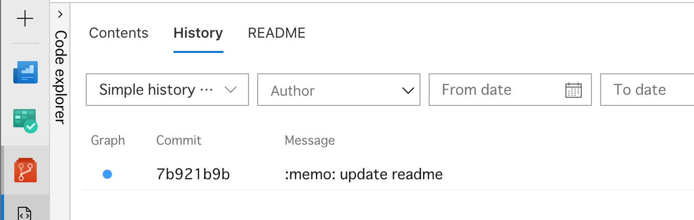
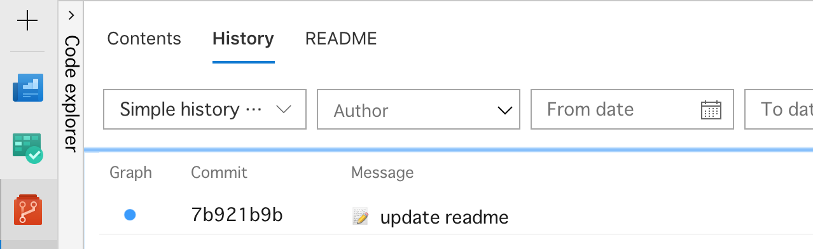

# Azure Devops gitmoji

Display [gitmoji](https://gitmoji.carloscuesta.me/) (emoji) in Azure Devops Repos.

1. Add Chrome Extention [Tampermonkey](https://chrome.google.com/webstore/detail/tampermonkey/dhdgffkkebhmkfjojejmpbldmpobfkfo.).
2. [Install](https://github.com/nkmr-jp/userscripts/raw/master/Azure_Devops_gitmoji/script.user.js). 

↓↓↓

