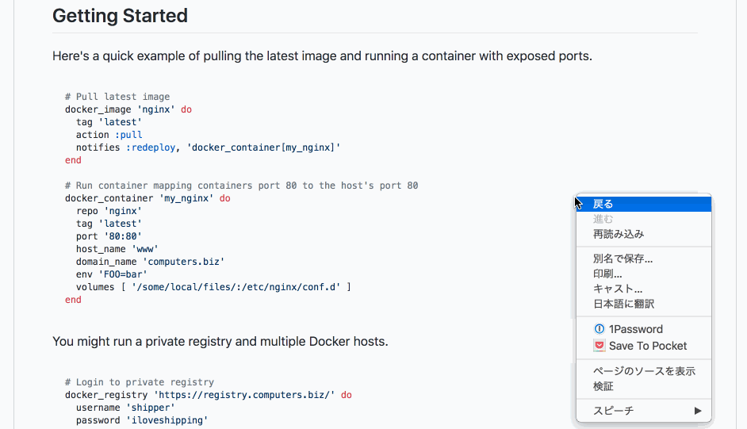

# Github code translate ignore

Translate excluding code blocks when translating pages with Google Translate.

1. Add Chrome Extention [Tampermonkey](https://chrome.google.com/webstore/detail/tampermonkey/dhdgffkkebhmkfjojejmpbldmpobfkfo.).
2. [Install](https://github.com/nkmr-jp/userscripts/raw/master/Github_code_translate_ignore/script.user.js). 

↓↓↓

