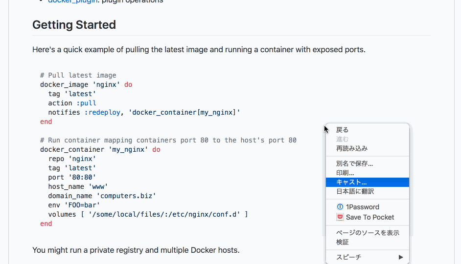

# userscripts

## usage

1. Install Chrome Extention [Tampermonkey](https://chrome.google.com/webstore/detail/tampermonkey/dhdgffkkebhmkfjojejmpbldmpobfkfo.)
2. Click scripts `install` link.

## scripts

Github_code_translate_ignore

Translates pages excluding code blocks.

[install](https://github.com/nkmr-jp/userscripts/raw/master/Github_code_translate_ignore.user.js)

before

after

