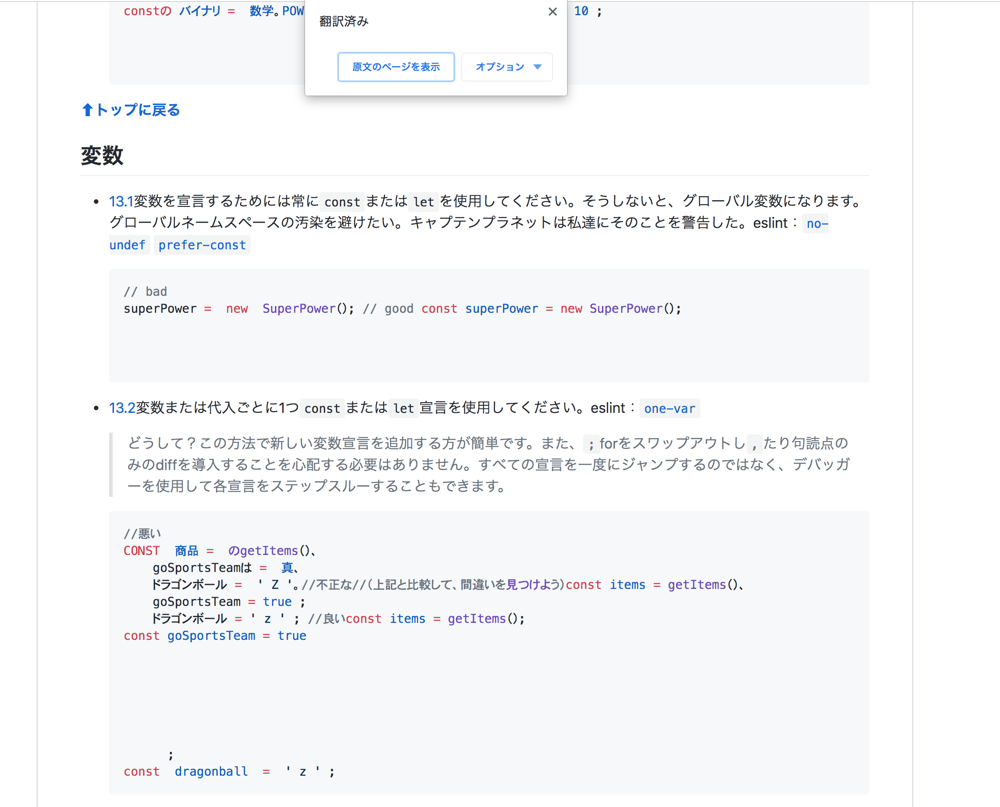

# Translate excluding code

Translate excluding code blocks when translating pages with Google Translate.

1. Add Chrome Extention [Tampermonkey](https://chrome.google.com/webstore/detail/tampermonkey/dhdgffkkebhmkfjojejmpbldmpobfkfo).
2. [Install](https://github.com/nkmr-jp/userscripts/raw/master/Translate_excluding_code/script.user.js). 

Example: 

The following is the Variables section of the README page of the airbnb JavaScript Style Guide repository, translated with Chrome's 'Translated into Japanese' (Google Translate). 

[GitHub - airbnb/javascript: JavaScript Style Guide #variables](https://github.com/airbnb/javascript#variables)

Before

↓↓↓

After

